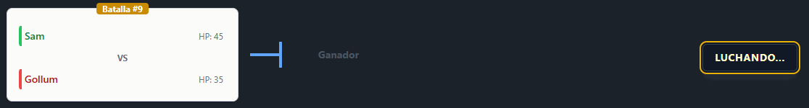
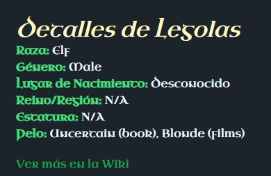
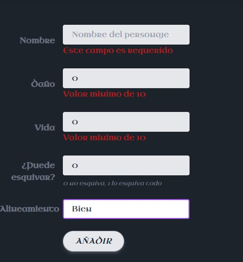
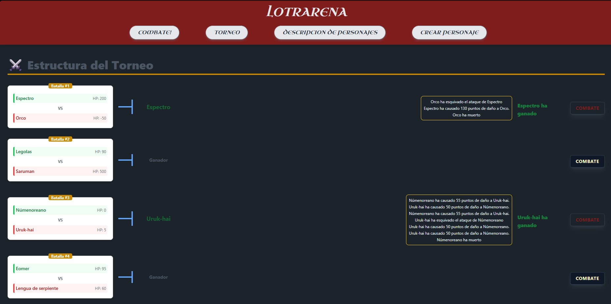

## ⚔️ RingsArena

> Angular SPA que simula combates entre personajes del universo de El Señor de los Anillos con sistema de torneos eliminatorios en tiempo real, centrado en lógica de negocio frontend y estado reactivo.

## 🎬 Live Demo

## ⚡ Core Features

- ⚔️ Sistema de combate en tiempo real con lógica de daño/esquiva
- 🏆 Torneos eliminatorios automáticos con emparejamientos dinámicos
- 🔁 Gestión de estado reactivo entre rondas
- 📡 Consumo de API REST externa
- 🧠 Lógica de negocio compleja en frontend (simulación de combate)
- 🧩 Arquitectura modular basada en servicios Angular

## 🧭 Exploración de personajes

## ⚔️ Combate

## 🧙 Creación de personajes

## 🏆 Torneo

## 🧠 Architecture

- Angular standalone components
- Services layer para separación de lógica de negocio
- RxJS para estado reactivo (Subjects / Observables)
- TypeScript interfaces para modelado de datos
- HttpClient como capa de integración API
- Routing modular con vistas independientes

## 🧰 Tech Stack

Angular • TypeScript • RxJS • Angular Router • Reactive Forms • HttpClient • Standalone Components

## 🚀 Live Demo
https://lotrarena.netlify.app

## 🎯 Project Goal

Este proyecto está enfocado en la práctica de arquitectura frontend en Angular, simulación de lógica de negocio compleja y gestión de estado reactivo en aplicaciones SPA modernas.
